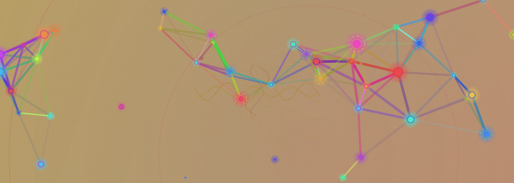

# ConsciousCanvas

A dynamic art generator that visualizes consciousness profiles through unique artistic representations based on the Consciousness Equation.



## Overview

ConsciousCanvas is an interactive web application that generates artistic visualizations of consciousness profiles. It uses a mathematical model called the Consciousness State Complexity Index (CSCI) to create unique visual representations based on three key parameters:

- **Information Density**: The amount of information processed by consciousness
- **Knowledge Base**: The depth and breadth of knowledge
- **Cognitive Complexity**: The level of abstract thinking and pattern recognition

## Features

### Interactive Visualization
- Real-time parameter display showing current values for all consciousness parameters
- Click on any element in the visualization to reveal detailed information
- Interactive points, particles, waves, and vortices that respond to user interaction
- Detailed information panel showing element type, value, and philosophical description
- Smooth animations and transitions between different consciousness states

### Parameter Controls
- Intuitive slider controls for adjusting consciousness parameters
- Real-time value updates and synchronization
- Visual feedback through both slider values and parameter display
- Value ranges from 0 to 100 for precise control

### Quantum Mode
- Quantum-inspired visualization with particles, waves, and vortices
- Entanglement effects between particles
- Wave function collapse simulation
- Dynamic energy fields and consciousness propagation
- Real-time particle interactions and movements

### Standard Mode
- Concentric circles representing layers of cognitive complexity
- Information density patterns
- Knowledge base visualization
- Cognitive complexity representation
- Dynamic color gradients based on consciousness parameters

### Customization
- Adjustable parameters:
  - Information Density (0-100): Controls the density of visual elements
  - Knowledge Base (0-100): Affects the complexity and interconnectedness
  - Cognitive Complexity (0-100): Influences the layering and structure
- Real-time visualization updates
- CSCI (Consciousness State Complexity Index) calculation
- Save functionality for exporting your creations

### Quantum Mode Toggle
- The Quantum Mode toggle is now a checkbox with a checkmark when enabled, making it visually clear when the mode is active.
- Enable Quantum Mode by clicking the checkbox; a checkmark will appear when active.
- Disable Quantum Mode by unchecking the box.
- **Audio feedback:** When you enable Quantum Mode (check the box), a short sound will play to confirm activation.

## Installation

### Prerequisites
- A modern web browser (Chrome, Firefox, Safari, or Edge)
- JavaScript enabled
- No additional dependencies required

### Setup
1. Clone this repository:
   ```bash
   git clone https://github.com/yourusername/ConsciousCanvas.git
   cd ConsciousCanvas
   ```

2. Open the project:
   - For users: Simply open `index.html` in your web browser
   - For developers: Use a local server (e.g., `python -m http.server` or Live Server in VS Code)

## Usage

1. Open `index.html` in your web browser
2. Adjust the sliders to modify your consciousness visualization:
   - Watch the parameter display update in real-time
   - See immediate visual feedback in the canvas
   - Monitor the CSCI value changes
3. Toggle Quantum Mode:
   - Use the checkbox next to "Quantum Mode". When checked (with a checkmark), Quantum Mode is enabled; when unchecked, it is disabled.
4. Interact with elements:
   - Click on any visual element to view detailed information
   - Use the info panel to understand the element's significance
5. Generate your creation:
   - Click the "Generate AI Image" button to generate your visualization
6. Save your creation:
   - Click the "Save" button to download your visualization as PNG

## Interactive Elements

### Parameter Display
- Real-time value updates for all consciousness parameters
- Synchronized with slider controls
- Clear visual representation of current settings

### Standard Mode Elements
- **Circles**: Represent layers of cognitive complexity
- **Points**: Show information density distribution
- **Patterns**: Visualize knowledge base connections

### Quantum Mode Elements
- **Particles**: Quantum units with energy and charge
- **Waves**: Consciousness propagation patterns
- **Vortices**: Energy concentration points
- **Entanglement**: Connections between particles

## Project Structure

```
ConsciousCanvas/
├── index.html          # Main HTML file
├── script.js          # Core visualization logic
├── styles.css         # Styling and animations
└── docs/             # Documentation
    └── screenshot.png # Application screenshot
```

## Technical Details

### Visualization Engine
- HTML5 Canvas for rendering
- RequestAnimationFrame for smooth animations
- Dynamic gradient generation
- Real-time parameter updates and synchronization

### Parameter Management
- Real-time value synchronization
- Event-driven updates
- Persistent state management
- Cross-component communication

### Quantum Simulation
- Particle physics-inspired behaviors
- Wave function calculations
- Entanglement mechanics
- Field interactions

### User Interface
- Responsive design
- Touch-friendly controls
- Real-time parameter updates
- Informative tooltips
- Synchronized value displays

## Contributing

Contributions are welcome! Please feel free to submit a Pull Request.

1. Fork the repository
2. Create your feature branch (`git checkout -b feature/amazing-feature`)
3. Commit your changes (`git commit -m 'Add some amazing feature'`)
4. Push to the branch (`git push origin feature/amazing-feature`)
5. Open a Pull Request

## License

This project is licensed under the MIT License - see the LICENSE file for details.

## Acknowledgments

- Inspired by quantum mechanics and consciousness theories
- Built with modern web technologies
- Special thanks to all contributors and users